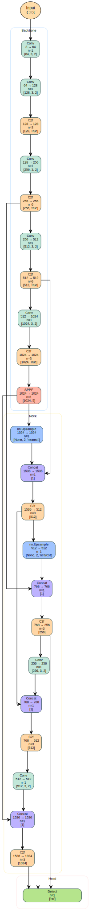
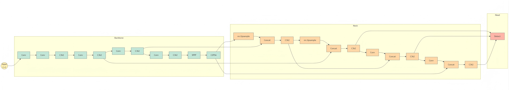

# YAML2ModelGraph  

[](https://www.python.org/)  
[](LICENSE)  

---

## 项目简介

**YAML2ModelGraph** 是一个将 Ultralytics 模型的 YAML 配置文件，自动生成模型结构图的工具。  

目前支持两种输出形式：

- 基于 **Graphviz** 的矢量结构图（SVG/PNG）
- 基于 **Mermaid** 的结构图（`.mmd`），方便在 Markdown / 文档网站中直接渲染

它的特点包括：  

- 支持 **backbone、neck 与 head 层** 的分组展示  
- 自动解析各模块 **输入输出通道**  
- 支持 **Concat 输出通道自动计算**  
- 支持 **竖版布局**（Graphviz）、**直角边**，便于论文和文档展示  
- Mermaid 版本支持 **横板布局**，适合嵌入到 README、文档网站  
- **美化节点和子图**，直观展示模型结构  
- 可扩展，可适配 **自定义模块**  

---

## 功能特点

1. **YAML 自动解析**  
   - 读取模型 YAML 文件，自动解析每一层的模块类型、重复次数、输入输出通道及参数。  
   - 兼容 Ultralytics YOLO 系列的 backbone/head 定义方式。  

2. **自动生成 Graphviz 图（`yml2modelgraph.py`）**  
   - Backbone、Neck 和 Head 自动分组  
   - 支持竖版 Top→Bottom 展示  
   - 线条直角连接，整洁美观  
   - 支持输出 SVG 或 PNG 格式  

3. **自动生成 Mermaid 图（`yml2modelgraph_mermaid.py`）**  
   - 输出标准 Mermaid Flowchart 语法（`.mmd`）  
   - 节点显示信息可配置（例如：只显示模块名，或增加通道、参数等）  
   - 搭配 Mermaid 在线编辑器、文档平台（如 GitHub / GitLab / MkDocs）即可直接可视化  

4. **模块兼容**  
   支持常见的 Conv、C3/C2 系列、SPPF、Concat、Detect 等模块，  
   也可以通过简单修改解析逻辑扩展到自定义模块。  

---

## 效果

<details>
<summary>点击展开查看 Graphviz 效果图</summary>


<div align="center">

</div>

</details>

<details>
<summary>点击展开查看 Mermaid 示例</summary>

</details>

------

## 安装

### 系统依赖（Graphviz 输出）

如果只使用 Mermaid 输出，**可以不安装 Graphviz**。
 如需 Graphviz 图（SVG/PNG），需要安装：

```bash
sudo apt update -y                # Ubuntu/Debian
sudo apt install graphviz -y      

brew install graphviz             # macOS
```

### Python 依赖

```bash
pip install pyyaml graphviz
```

> 说明：Mermaid 版本只依赖 `pyyaml`，但一并安装 `graphviz` 也无妨。

------

## 使用方法

### 1. 生成 Graphviz 图（原脚本）

```bash
python yml2modelgraph.py path/to/model.yaml [out_name] [--format svg|png]
```

- `path/to/model.yaml`：模型 YAML 文件路径
- `[out_name]`：输出文件名（默认 `model_graph_fixed`）
- `[--format svg|png]`：输出格式（默认 `svg`）

#### 示例

```bash
python yml2modelgraph.py yolov8s.yaml yolov8s_graph --format svg
```

将生成文件 `yolov8s_graph.svg`，包含 Backbone、Neck、Head 的详细结构及每层输入输出通道。

------

### 2. 生成 Mermaid 图（新增脚本）

Mermaid 版本会生成 `.mmd` 文件，可以直接粘到 Markdown 中使用，
 或者丢到 Mermaid 在线编辑器中查看。

```bash
python yml2modelgraph_mermaid.py path/to/model.yaml [out_name]
```

- `path/to/model.yaml`：模型 YAML 文件路径
- `[out_name]`：输出 Mermaid 文件名（默认 `model_graph`，生成 `model_graph.mmd`）

#### 示例

```bash
python yml2modelgraph_mermaid.py yolov8s.yaml yolov8s_mermaid
```

------

## 输出示例（Graphviz）

每个节点显示信息包括：

- 模块类型
- 输入通道 → 输出通道
- 重复次数 n
- 模块参数 args

示例节点：

```
Conv
64 → 128
n=1
[3, 3, 2]
```

Edges 使用直角线显示，保证图像整洁美观。Backbone / Neck / Head 分组显示，便于理解模型结构。

------

## 输出示例（Mermaid）

Mermaid 版本的单个节点典型形式（具体字段可配置）：

```mermaid

```

你可以通过脚本配置：

- 只显示模块名：`Conv`
- 显示模块名 + 通道：`Conv<br>64→128`
- 显示更多信息：`Conv<br>64→128<br>n=2<br>[3, 3, 2]`

根据文档场景控制信息密度。

------

## 项目结构

```text
YAML2ModelGraph/
├── yml2modelgraph.py            # 基于 Graphviz 的核心脚本
├── yml2modelgraph_mermaid.py    # 基于 Mermaid 的导出脚本（新增）
├── README.md                    # 项目说明
├── LICENSE                      # MIT License
└── examples/                    # 示例 YAML 文件
```

------

## 开发与贡献

欢迎贡献：

- 增加 HTML 或交互式导出
- 优化图形美化与排版
- 改进 Mermaid 版本的布局与样式（如主题、配色、分组方式）

Fork 本项目，提交 Pull Request 即可。

------

## 许可证

本项目使用 **MIT License** 开源，允许商用、修改和分发。
