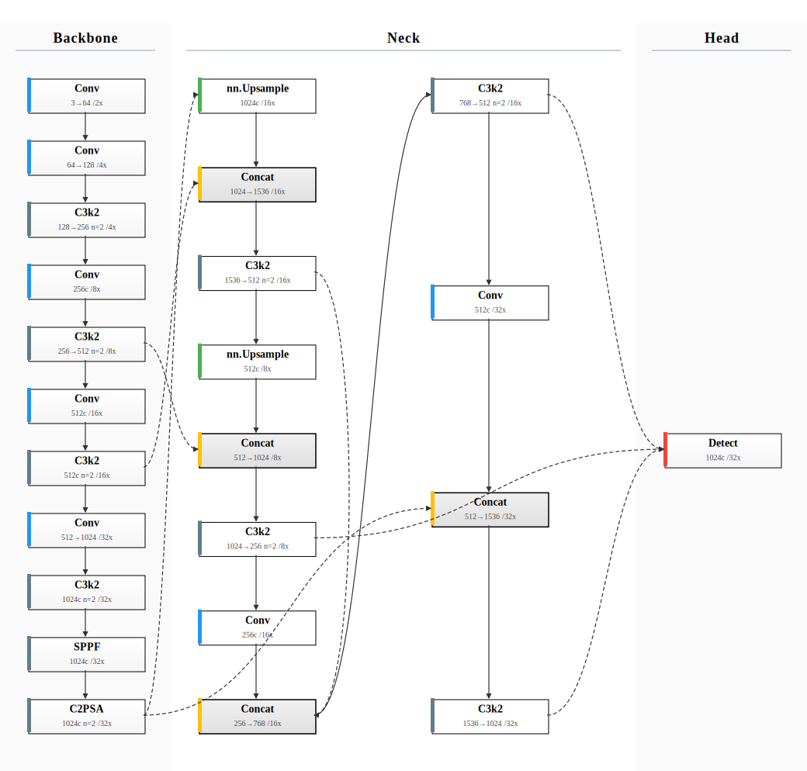
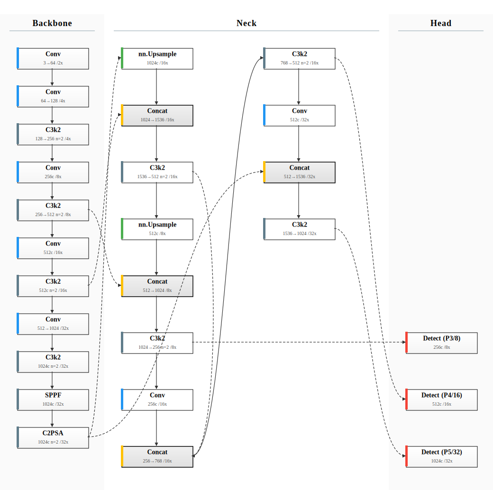
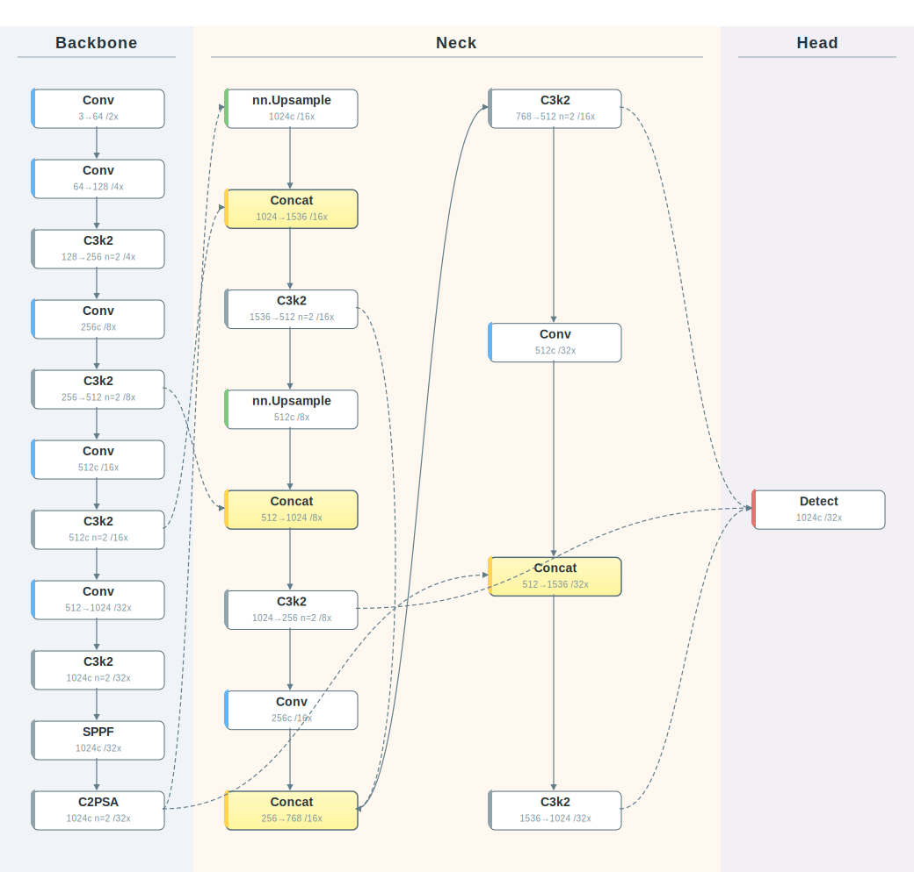
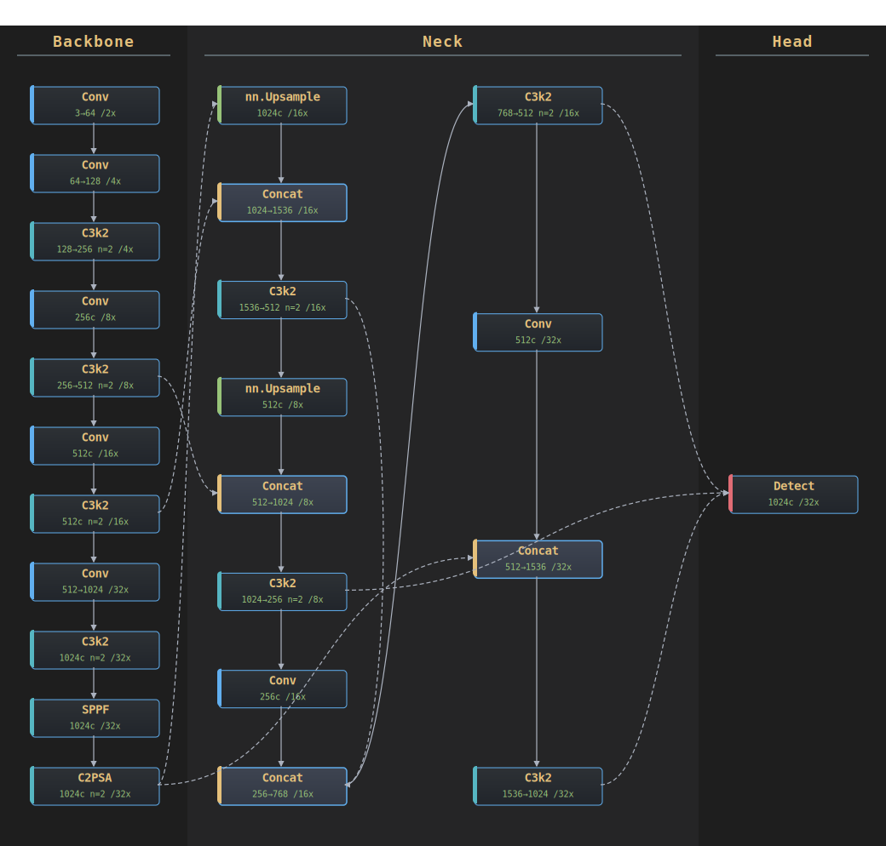
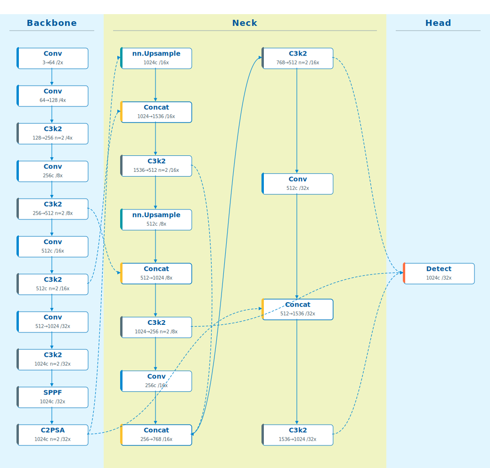
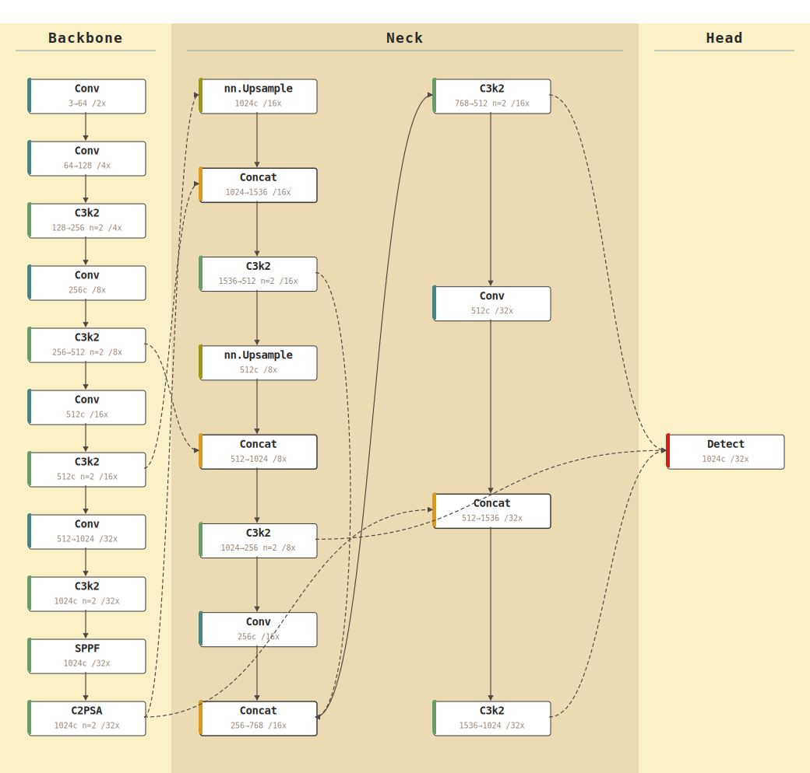
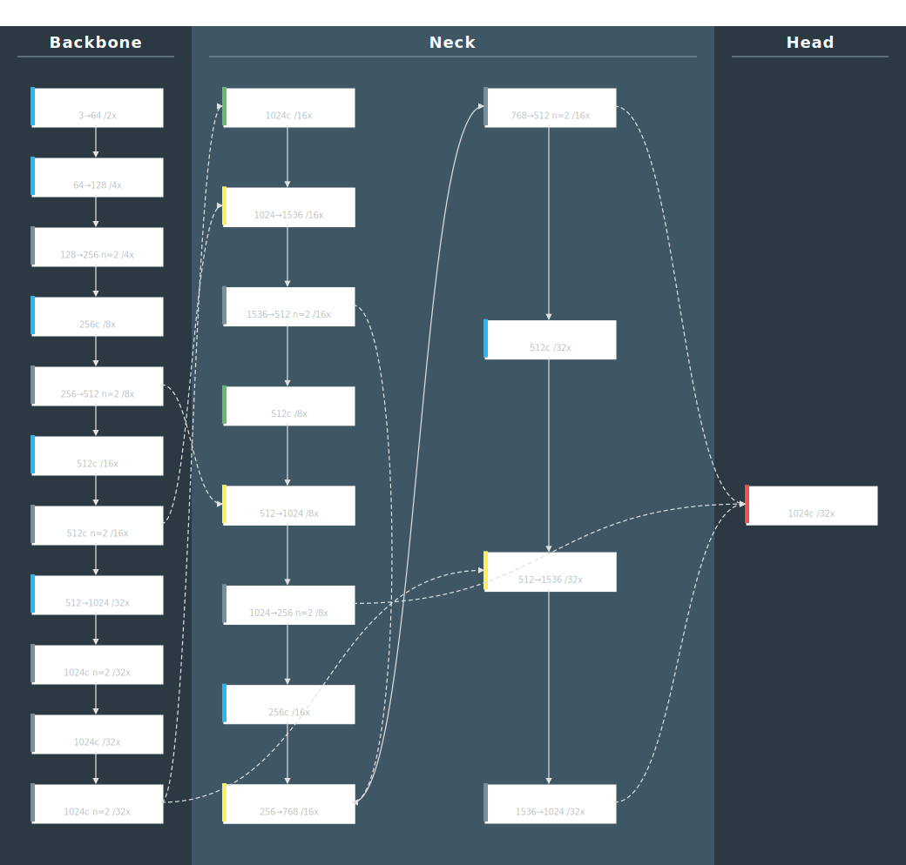
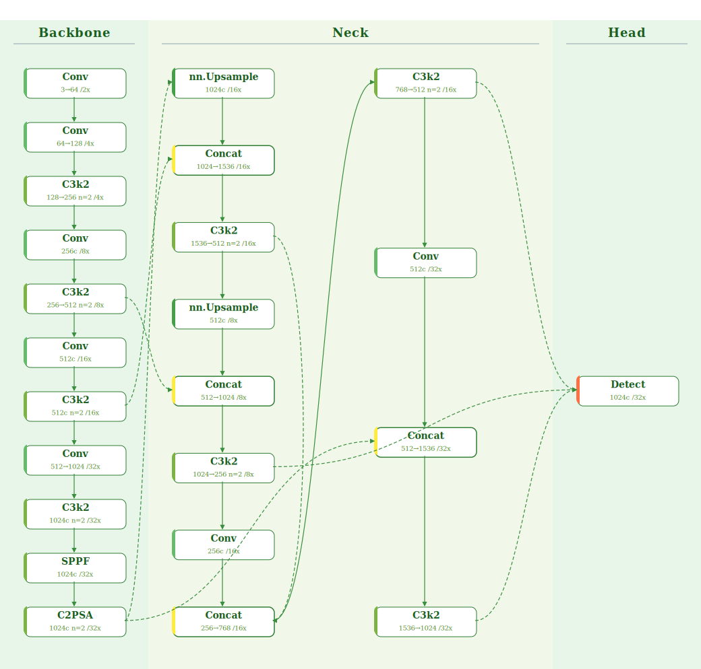
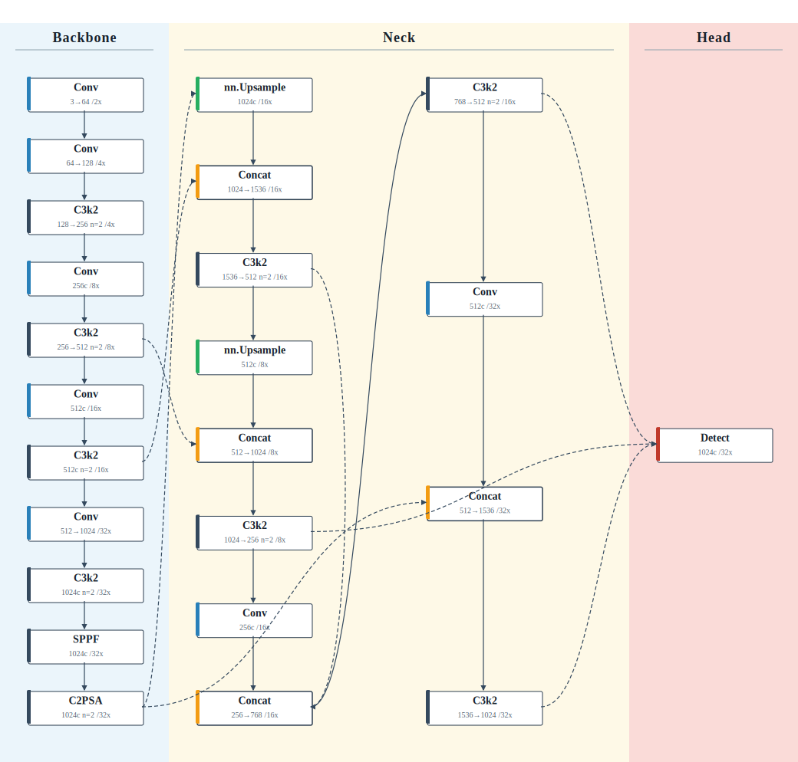
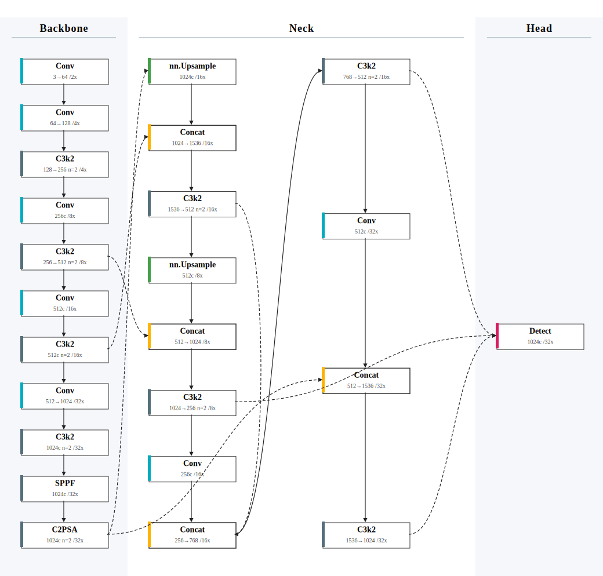

<div align="center">

# YAML2ModelGraph

**Generate publication-ready SVG architecture diagrams from YOLO YAML configs.**

[](https://www.python.org/)
[](LICENSE)
[](https://github.com/WangQvQ/YAML2ModelGraph/stargazers)

[English](README.md) | [中文](README_CN.md)




*Single head mode (left) · Triple head mode (right)*

</div>

---

## ✨ Features

- **9 Themes** — Paper, Candy, Dark, Ocean, Retro, Blueprint, Forest, Paper RYB, Journal
- **Dual Head Modes** — Single `Detect` node or split P3/8 · P4/16 · P5/32 heads
- **Smart Layout** — Backbone vertical stacking, Neck multi-column folding, Head auto-alignment
- **Rich Metadata** — Channel counts, stride, repeat counts on every node
- **Zero Dependencies** — Only `pyyaml`, pure Python, SVG output

## 🚀 Quick Start

```bash
pip install pyyaml
git clone https://github.com/WangQvQ/YAML2ModelGraph.git && cd YAML2ModelGraph
```

```bash
# Single head (default)
python main.py examples/yolo26.yaml output.svg

# Triple head
python main.py examples/yolo26.yaml output.svg --head multi

# Choose a theme
python main.py examples/yolo26.yaml output.svg --theme dark --head multi
```

## 🎨 Themes

<div align="center">

| Paper | Candy | Dark | Ocean | Retro | Blueprint | Forest | Paper RYB | Journal |
|:---:|:---:|:---:|:---:|:---:|:---:|:---:|:---:|:---:|
|  |  |  |  |  |  |  |  |  |
| Academic | Modern | Geek | Ocean | Retro | Blueprint | Nature | RYB ⭐ | Journal |

</div>

## 🧩 Head Modes

| Mode | Flag | Description |
|:---:|:---:|:---|
| **Single** | `--head single` | One `Detect` node (default) |
| **Triple** | `--head multi` | `Detect (P3/8)` · `Detect (P4/16)` · `Detect (P5/32)`, bottom-aligned |

## ⚙️ Configuration

Edit `DISPLAY_CONFIG` in `main.py` to control node labels:

```python
DISPLAY_CONFIG = {
    "show_channels": True,  # e.g., 64→128 or 128c
    "show_repeats":  True,  # e.g., n=3
    "show_stride":   True,  # e.g., /32x
    "show_args":     False, # e.g., a:3,2 — disable if text overflows
}
```

## 📁 Structure

```
YAML2ModelGraph/
├── main.py           # CLI entry point
├── yolo_graph.py     # Core parsing & SVG generation
├── themes.py         # 9 theme definitions
├── examples/         # YOLO YAML configs (yolo26, yolo11, yolo12, yolov9s)
└── svg/              # Pre-generated SVG examples
    ├── graph_*.svg         # Single head
    └── multi/graph_*.svg   # Triple head
```

## 🤝 Contributing

Issues and PRs welcome!

## 📄 License

[MIT](LICENSE) — free for commercial and personal use.

## 🙏 Acknowledgments

Built on the [Ultralytics YOLO](https://github.com/ultralytics/ultralytics) framework and YAML model format.
