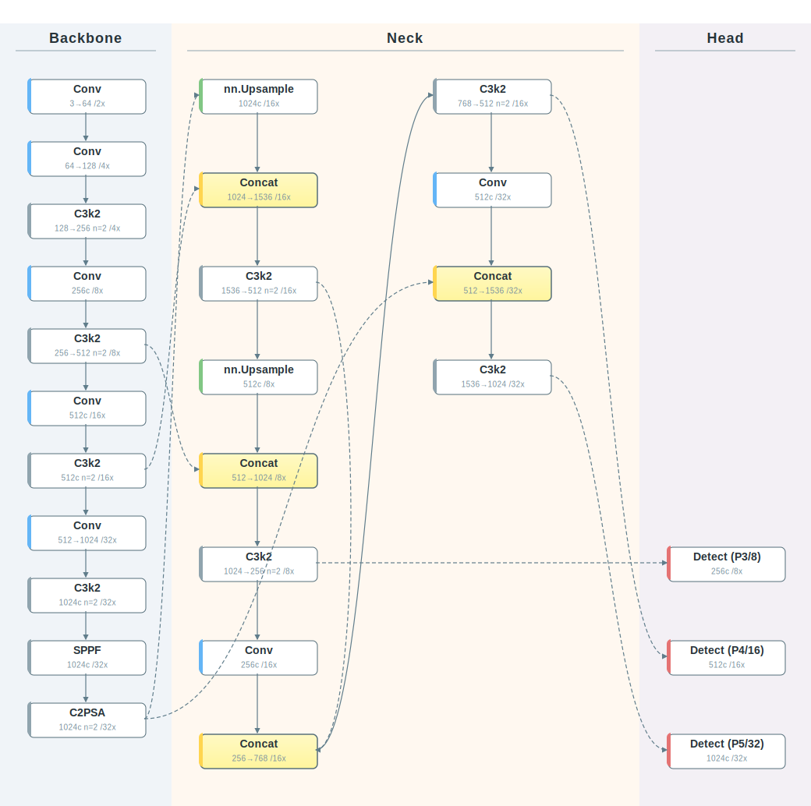
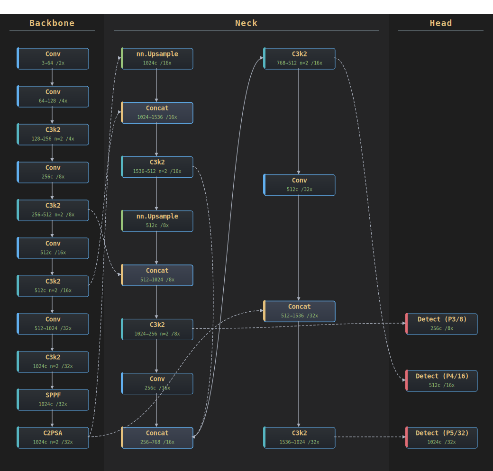
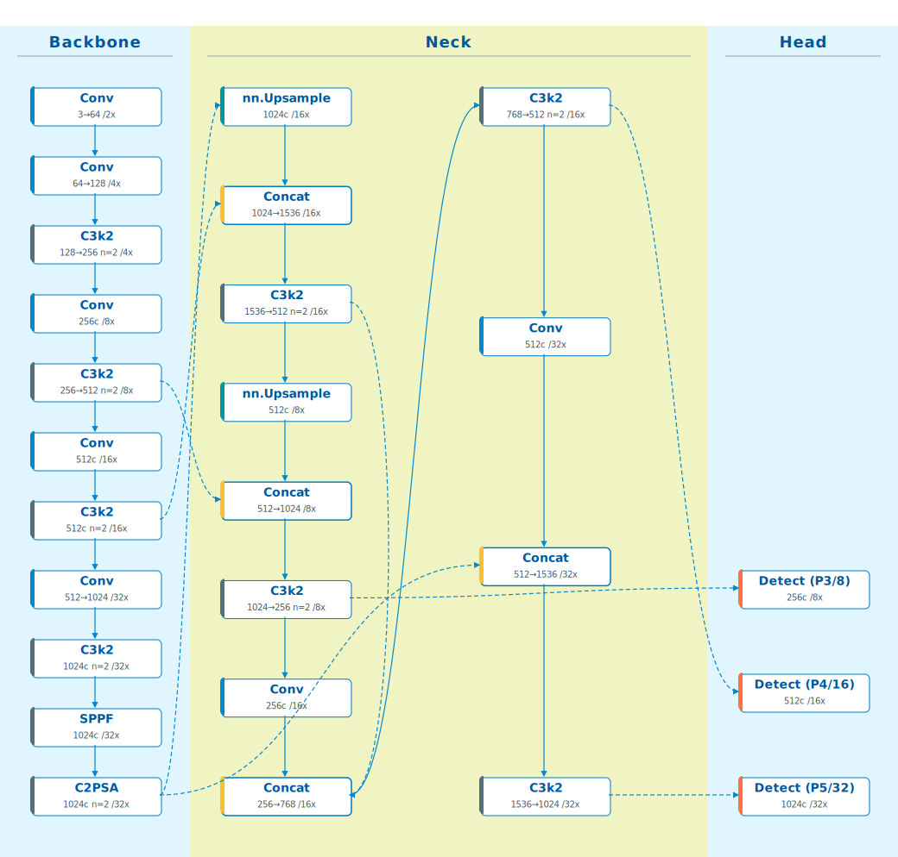
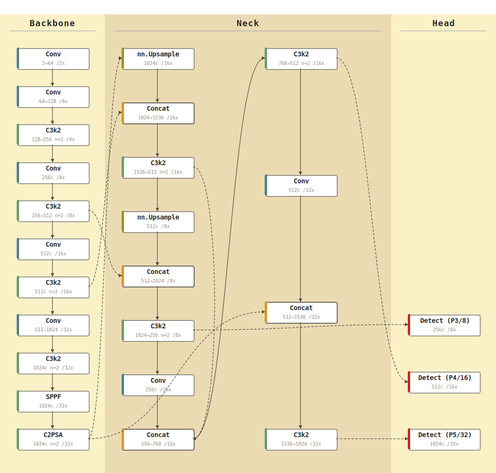
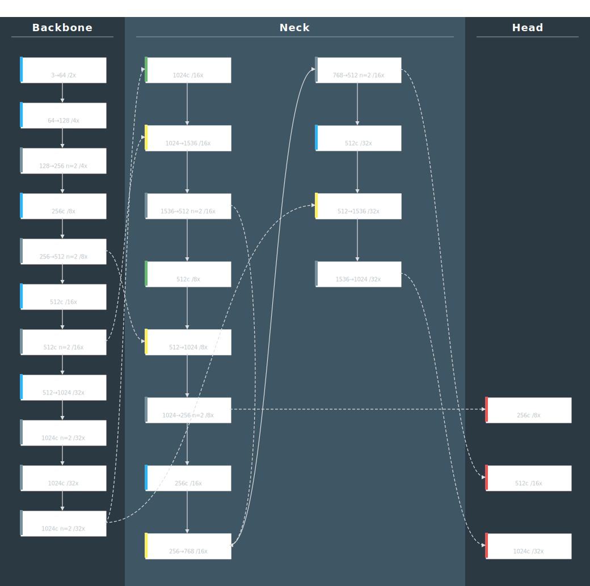
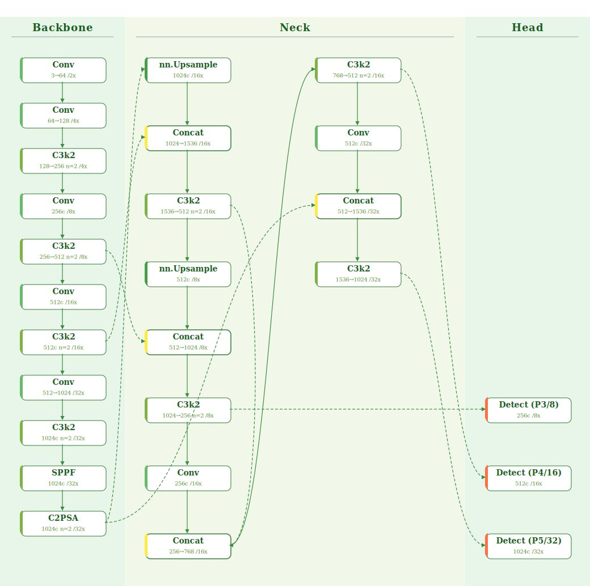
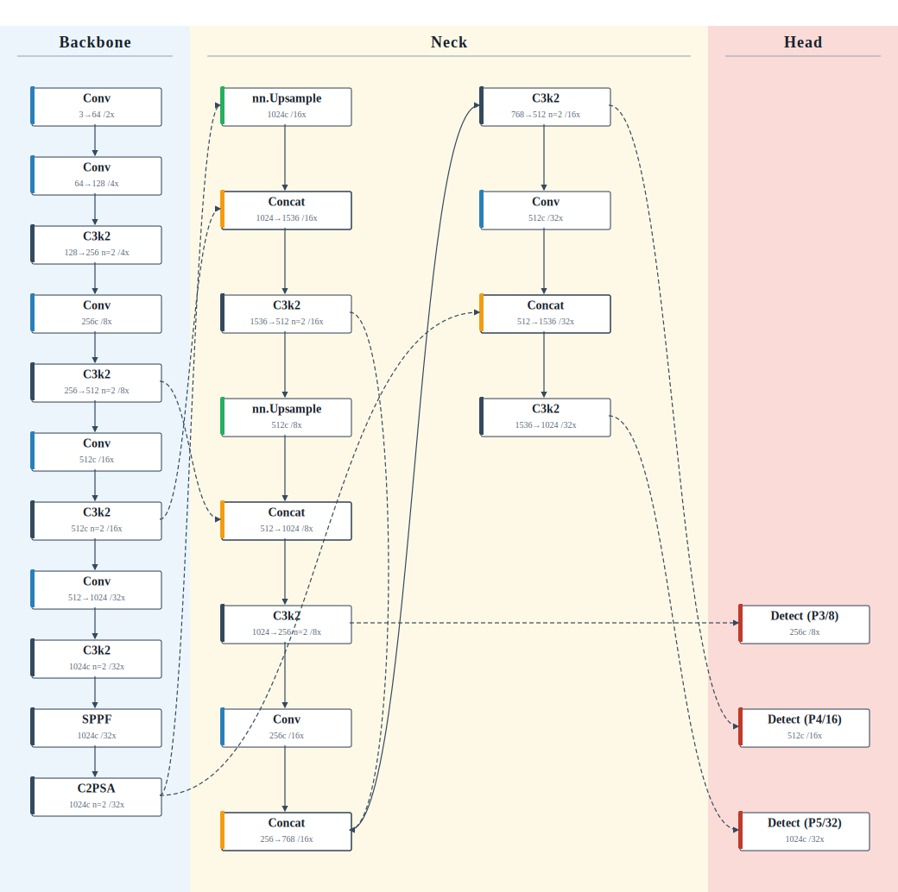
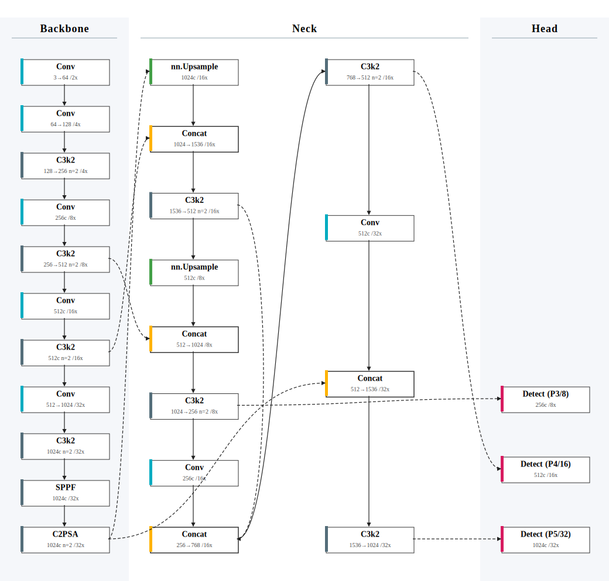

# YAML2ModelGraph

<div align="right">

[English](README_EN.md) | [中文](README.md)

</div>

[](https://www.python.org/)  
[](LICENSE)

---

## 📖 Introduction

**YAML2ModelGraph** is a professional YOLO model architecture visualization tool that automatically converts Ultralytics YOLO model YAML configuration files into beautiful SVG architecture diagrams.

### ✨ Key Features

- 🎨 **9 Beautiful Themes**: From academic paper style to modern candy colors, meeting different scenario needs
- 🧩 **Dual Head Modes**: Single head (`single`) and triple head (`multi`) Detect display modes
- 📐 **Smart Layout**: Automatically identifies Backbone, Neck, and Head modules with intelligent multi-column folding
- 🔗 **Clear Connections**: Supports multiple connection styles (straight lines, Bézier curves, Manhattan routing)
- 📊 **Rich Information**: Displays module types, stride, channel numbers, and other key information
- 🎯 **Ready to Use**: No additional dependencies required, pure Python + SVG output

---

## 🧩 Single Head vs Triple Head

Use the `--head` parameter to switch between Detect display modes:

| Mode | Parameter | Description |
|:---:|:---:|:---|
| **Single** | `--head single` | Default mode, Detect shown as a single node |
| **Triple** | `--head multi` | Detect split into P3/8, P4/16, P5/32 as separate nodes, bottom-aligned |

<div align="center">

<table>
<tr>
<td align="center"><b>--head single</b> (default)</td>
<td align="center"><b>--head multi</b> (triple)</td>
</tr>
<tr>
<td></td>
<td></td>
</tr>
</table>

</div>

```bash
# Single head mode (default)
python main.py examples/yolo26.yaml output.svg

# Triple head mode
python main.py examples/yolo26.yaml output.svg --head multi
```

---

## 🖼️ Theme Showcase

<div align="center">

### 9 Theme Styles Overview (Single Head)

<table>
<tr>
<td align="center"><b>Paper</b><br/>Academic Standard</td>
<td align="center"><b>Candy</b><br/>Modern Candy</td>
<td align="center"><b>Dark</b><br/>Dark Geek</td>
</tr>
<tr>
<td></td>
<td></td>
<td></td>
</tr>
<tr>
<td align="center"><b>Ocean</b><br/>Tech Ocean</td>
<td align="center"><b>Retro</b><br/>Retro Warm</td>
<td align="center"><b>Blueprint</b><br/>Engineering Blueprint</td>
</tr>
<tr>
<td></td>
<td></td>
<td></td>
</tr>
<tr>
<td align="center"><b>Forest</b><br/>Forest Nature</td>
<td align="center"><b>Paper RYB</b><br/>Academic RYB ⭐</td>
<td align="center"><b>Journal</b><br/>Modern Journal</td>
</tr>
<tr>
<td></td>
<td></td>
<td></td>
</tr>
</table>

### 9 Theme Styles Overview (Triple Head)

<table>
<tr>
<td align="center"><b>Paper</b><br/>Academic Standard</td>
<td align="center"><b>Candy</b><br/>Modern Candy</td>
<td align="center"><b>Dark</b><br/>Dark Geek</td>
</tr>
<tr>
<td></td>
<td></td>
<td></td>
</tr>
<tr>
<td align="center"><b>Ocean</b><br/>Tech Ocean</td>
<td align="center"><b>Retro</b><br/>Retro Warm</td>
<td align="center"><b>Blueprint</b><br/>Engineering Blueprint</td>
</tr>
<tr>
<td></td>
<td></td>
<td></td>
</tr>
<tr>
<td align="center"><b>Forest</b><br/>Forest Nature</td>
<td align="center"><b>Paper RYB</b><br/>Academic RYB ⭐</td>
<td align="center"><b>Journal</b><br/>Modern Journal</td>
</tr>
<tr>
<td></td>
<td></td>
<td></td>
</tr>
</table>

> 💡 **Tip**: All SVG files are located in `svg/` (single head) and `svg/multi/` (triple head) directories, viewable directly or usable in papers/documents

</div>

---

## 🚀 Quick Start

### Install Dependencies

```bash
pip install pyyaml
```

### Basic Usage

```bash
python main.py examples/yolo26.yaml output.svg --theme paper
```

**Parameters:**
- `examples/yolo26.yaml`: Input YAML model configuration file
- `output.svg`: Output SVG file path (optional, defaults to `yolo_graph.svg`)
- `--theme paper`: Select theme style (optional, defaults to `paper`)
- `--head single`: Select head display mode (optional, defaults to `single`; set to `multi` for three separate Detect heads)

---

## 🎨 Theme Styles

**9 carefully designed themes** for different scenarios:

### 1. Academic Standard (Paper) - Default Theme

**Features:** Black, white, and gray color scheme, Times New Roman font, minimalist lines  
**Use Case:** Designed specifically for IEEE / CVPR / thesis illustrations, best print quality

```bash
python main.py examples/yolo26.yaml svg/graph_paper.svg --theme paper
```

### 2. Modern Candy (Candy)

**Features:** Morandi color palette (light blue/orange), large rounded corners, sans-serif font  
**Use Case:** Suitable for PPT presentations, technical blogs, posters, visually vibrant and modern

```bash
python main.py examples/yolo26.yaml svg/graph_candy.svg --theme candy
```

### 3. Dark Geek (Dark)

**Features:** Dark background, high contrast lines, code-style font  
**Use Case:** Suitable for dark mode reading, screen presentations, showcasing "hardcore" technical feel

```bash
python main.py examples/yolo26.yaml svg/graph_dark.svg --theme dark
```

### 4. Tech Ocean (Ocean)

**Features:** Various shades of blue tones, fresh and professional  
**Use Case:** Suitable for business presentations, tech company whitepapers

```bash
python main.py examples/yolo26.yaml svg/graph_ocean.svg --theme ocean
```

### 5. Retro Warm (Retro)

**Features:** Warm beige background (Gruvbox style), typewriter font  
**Use Case:** Suitable for long reading sessions (eye-friendly), documents pursuing retro artistic feel

```bash
python main.py examples/yolo26.yaml svg/graph_retro.svg --theme retro
```

### 6. Engineering Blueprint (Blueprint)

**Features:** Deep blue background, white fine lines, CAD engineering font  
**Use Case:** Showcasing "architecture design" and "underlying logic" in hardcore engineering diagrams

```bash
python main.py examples/yolo26.yaml svg/graph_blueprint.svg --theme blueprint
```

### 7. Forest Nature (Forest)

**Features:** Green color scheme, fresh and natural  
**Use Case:** Eye-friendly style, or for emphasizing environmental/lightweight themes

```bash
python main.py examples/yolo26.yaml svg/graph_forest.svg --theme forest
```

### 8. Academic RYB (Paper RYB) ⭐ Recommended

**Features:** Classic red-yellow-blue color scheme with extremely low saturation, clear module distinction  
**Use Case:** Suitable for paper illustrations that need clear distinction between Backbone/Neck/Head module structures

```bash
python main.py examples/yolo26.yaml svg/graph_paper_ryb.svg --theme paper_ryb
```

### 9. Modern Journal (Journal)

**Features:** Minimalist cool style, almost invisible background, most rigorous academic style  
**Use Case:** Suitable for Springer or Nature sub-journal chart styles

```bash
python main.py examples/yolo26.yaml svg/graph_journal.svg --theme journal
```

---

## 📋 Feature Details

### Automatic Module Recognition

The tool automatically recognizes module types in YAML configurations, including:
- **Backbone Modules**: Conv, C2f, SPPF, etc.
- **Neck Modules**: Upsample, Concat, C2f, etc.
- **Head Modules**: Detect, etc.

### Smart Layout Algorithm

- **Backbone**: Single-column vertical layout, clearly showing feature extraction flow
- **Neck**: Intelligent multi-column folding, automatically splits into columns when modules are too many
- **Head**:
  - `single` mode: Detect node centered at the average y-coordinate of input sources
  - `multi` mode: Split into Detect (P3/8), Detect (P4/16), Detect (P5/32) as separate nodes, stacked from the bottom, with the lowest node aligned to the Backbone/Neck bottom

### Connection Styles

- **Vertical Straight**: Adjacent modules in the same column use straight lines
- **Bézier Curves**: Cross-column connections use smooth curves
- **Manhattan Routing**: Backbone to Neck uses right-angle routing
- **Dashed Lines**: Cross-module or long-distance connections use dashed lines

### Information Display

Each node displays:
- **Main Label**: Module type (e.g., Conv, C2f, Detect)
- **Sub Label**: Stride and channel number (e.g., `8x / 256c`)

#### Information Display Configuration

You can customize the information displayed on nodes through the `DISPLAY_CONFIG` dictionary in `main.py`:

```python
DISPLAY_CONFIG = {
    "show_channels": True,  # Display channels (e.g., 64->128 or 128c)
    "show_repeats":  True,  # Display repeat count (e.g., n=3)
    "show_stride":   True,  # Display stride multiplier (e.g., /32x)
    "show_args":     False, # Display detailed arguments (e.g., a:3,2) -> ⚠️ Turn this off if text overflows
}
```

**Configuration Options:**
- `show_channels`: Whether to display channel number changes (e.g., `64->128` or `128c`)
- `show_repeats`: Whether to display module repeat count (e.g., `n=3` means repeated 3 times)
- `show_stride`: Whether to display stride multiplier (e.g., `/32x` means 32x downsampling)
- `show_args`: Whether to display detailed arguments (e.g., `a:3,2`), **Note**: If node information is too much causing text overflow, it's recommended to set this option to `False`

---

## 📁 Project Structure

```
YAML2ModelGraph/
├── main.py              # Main program entry
├── yolo_graph.py        # Core parsing and layout logic
├── themes.py            # Theme configuration definitions
├── README.md            # Project documentation (Chinese)
├── README_EN.md         # Project documentation (English)
├── examples/            # Example YAML files
│   ├── yolo26.yaml
│   ├── yolo11.yaml
│   ├── yolo12.yaml
│   └── yolov9s.yaml
└── svg/                 # Generated SVG examples
    ├── graph_paper.svg          # Single head mode
    ├── graph_candy.svg
    ├── ...
    └── multi/                   # Triple head mode
        ├── graph_paper.svg
        ├── graph_candy.svg
        └── ...
```

---

## 🔧 Advanced Usage

### Custom Themes

Edit the `themes.py` file to:
- Modify existing theme colors, fonts, corner radius, etc.
- Add new theme configurations
- Adjust layout parameters (node size, spacing, etc.)

### Customize Information Display

Edit the `DISPLAY_CONFIG` dictionary in `main.py` to control which information is displayed on nodes:

```python
DISPLAY_CONFIG = {
    "show_channels": True,  # Display channel numbers
    "show_repeats":  True,  # Display repeat count
    "show_stride":   True,  # Display stride multiplier
    "show_args":     False, # Display detailed arguments (recommended to disable to avoid text overflow)
}
```

### Supported YAML Format

The tool is compatible with Ultralytics YOLO series YAML format:

```yaml
backbone:
  - [-1, 1, Conv, [64, 3, 2]]
  - [-1, 3, C2f, [128, True]]
  # ...

head:
  - [-1, 1, nn.Upsample, [None, 2, "nearest"]]
  - [[-1, 6], 1, Concat, [1]]
  # ...
```

---

## 🤝 Contributing

Welcome to submit Issues and Pull Requests!

**Possible Improvement Directions:**
- Add more theme styles
- Support custom node styles
- Optimize layout algorithms for complex models
- Add interactive SVG features

---

## 📄 License

This project uses the **MIT License**, allowing commercial use, modification, and distribution.

---

## 🙏 Acknowledgments

Thanks to the Ultralytics team for providing the YOLO framework and model definition format.

---

**Version:** v2.0  
**Last Updated:** 2025
